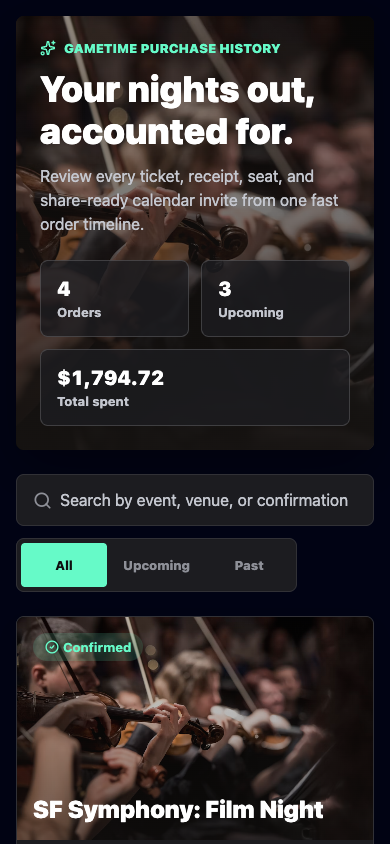
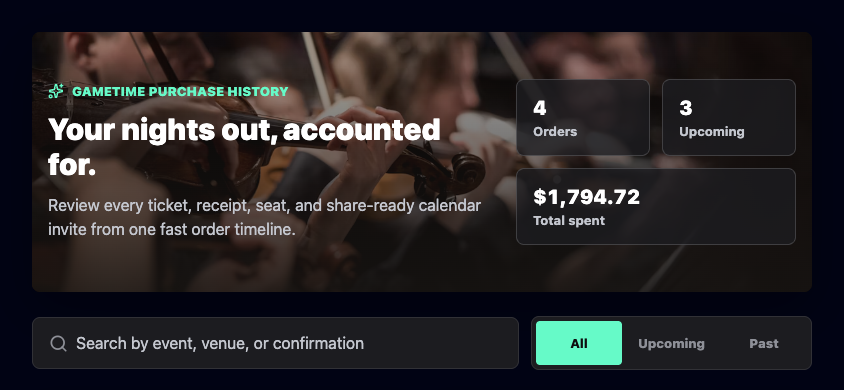
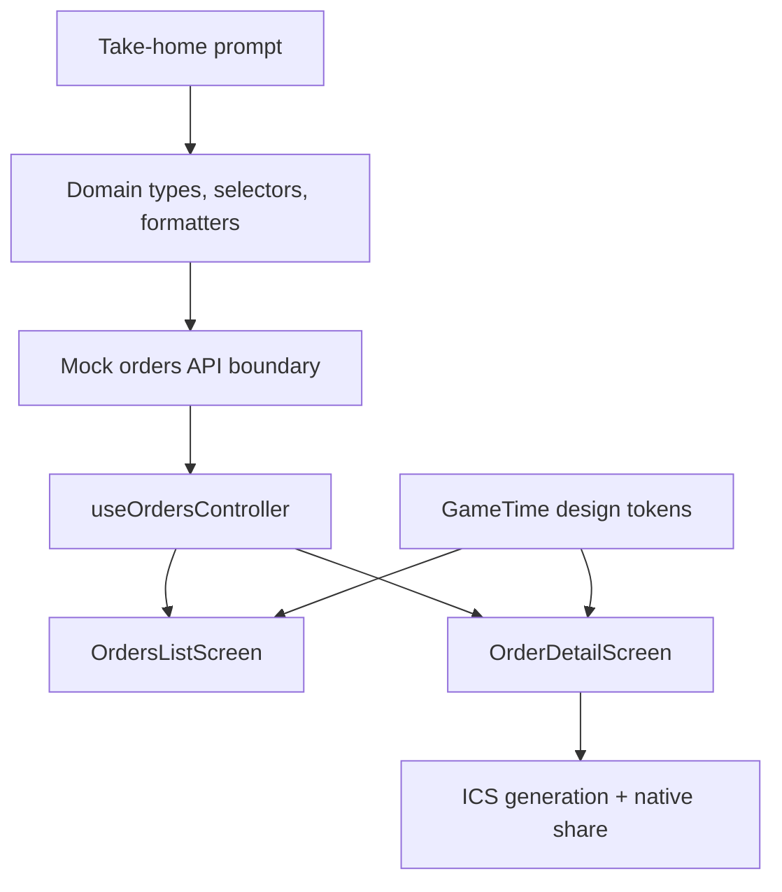
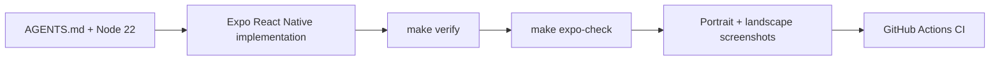

# GameTime Order History Mobile

[](https://github.com/jnrahme/GameTimeTest/actions/workflows/ci.yml)


Find the receipt. Share the night. Keep the group moving.

An Expo React Native mobile app for viewing past GameTime-style ticket
purchases, opening a receipt detail screen, and generating a share-ready
calendar event for friends. The implementation is deliberately mobile-first,
brand-aligned, rotation-aware, typed, tested, and reviewable.

Reviewer-facing line: a compact take-home prompt treated like a production
feature branch.

## Screenshots

These are not decorative mocks. They are generated from the working app and kept
in the repo as review assets.

| Portrait | Landscape |
| --- | --- |
|  |  |

## Implementation Showcase

Open the polished implementation website at [docs/index.html](docs/index.html).
It explains the architecture, product tradeoffs, MCP/skills setup, AGENTS.md
rules, quality gates, rotation-aware design decisions, and GitHub repo polish.

## Run Locally

```bash
nvm install 22
nvm use
npm ci
npm run ios
```

Android is available with `npm run android`. A browser preview is available with
`npm run web`, but the implementation is mobile-first React Native.

## Build & Verify

Entry point: [Makefile](Makefile).

```bash
nvm use
make verify
make expo-check
```

`make verify` runs TypeScript in strict mode and the Jest test suite.
`make expo-check` verifies Expo SDK package compatibility.

## Architecture



- `src/domain/orders`: prompt-aligned TypeScript entities, formatting,
  selectors, and calendar invite generation.
- `src/services`: mock network boundary for `GET /orders` and
  `GET /orders/:orderId`, plus share integration.
- `src/features/orders`: screen-level state orchestration and mobile-first React
  Native presentation.
- `src/components` and `src/theme`: reusable UI primitives and design tokens.

The UI follows the current `gametime.co` black, white, and mint visual language
while presenting a more receipt-focused mobile workflow. It is designed for
native phone ergonomics first: safe areas, rotation-aware portrait/landscape
layouts, 44px+ touch targets, accessible press labels, native share integration,
and responsive layouts that also hold up in Expo's web preview.

## Verification Loop



## Professional Repo Surface

The repo is structured so the public GitHub page communicates quality before a
reviewer even opens the source:

- Truthful badges for CI, Node 22, Expo SDK 56, React Native, TypeScript, and MIT.
- Community health files: [Code of Conduct](CODE_OF_CONDUCT.md),
  [Contributing](CONTRIBUTING.md), [Security](SECURITY.md), [License](LICENSE),
  and [.github/CODEOWNERS](.github/CODEOWNERS).
- Repeatable local and CI verification through `make verify`,
  `make expo-check`, and [.github/workflows/ci.yml](.github/workflows/ci.yml).
- Public repo metadata guidance in [docs/REPO_PROFILE.md](docs/REPO_PROFILE.md).
- Screenshot-backed documentation and a standalone implementation showcase.

## Tradeoffs

- Navigation is local state instead of a routing library because the prompt needs
  two screens, not deep linking.
- Calendar sharing generates standards-friendly ICS content and uses native/web
  share APIs when available, with clipboard fallback on web.
- Network calls are simulated with a mock API so the data boundary is easy to
  replace with a real backend.
- Tests focus on domain behavior and API boundaries where regressions would be
  most costly.
