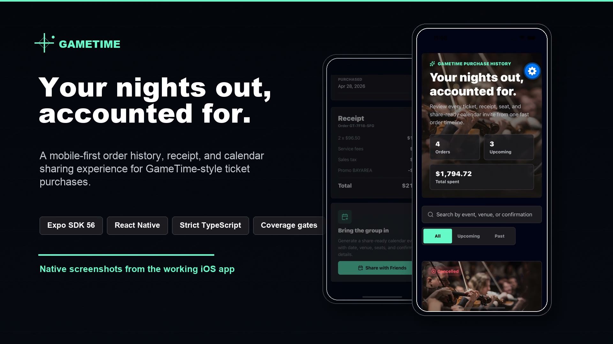
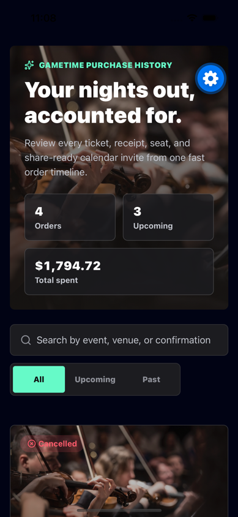
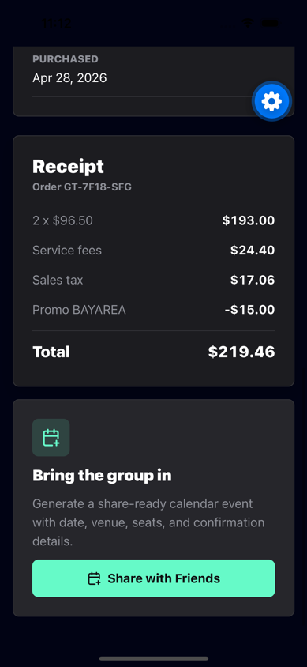
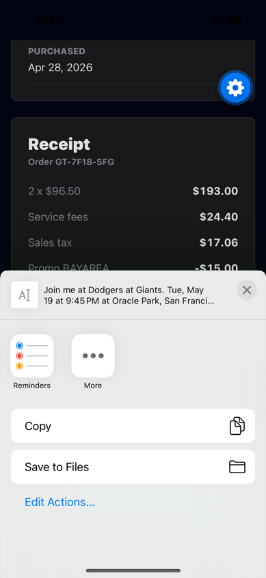
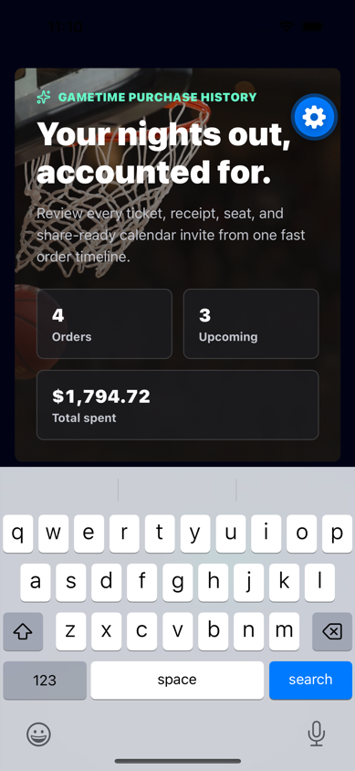
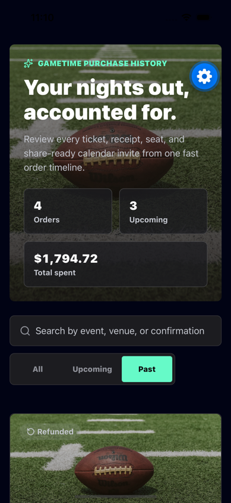
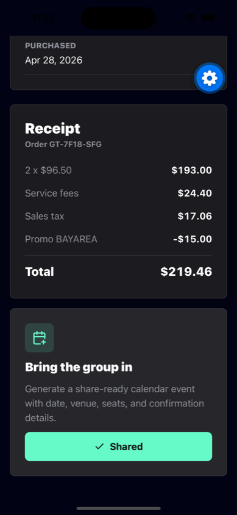
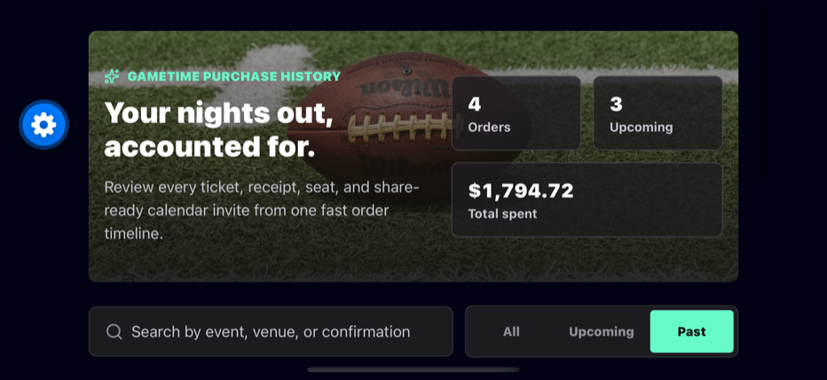
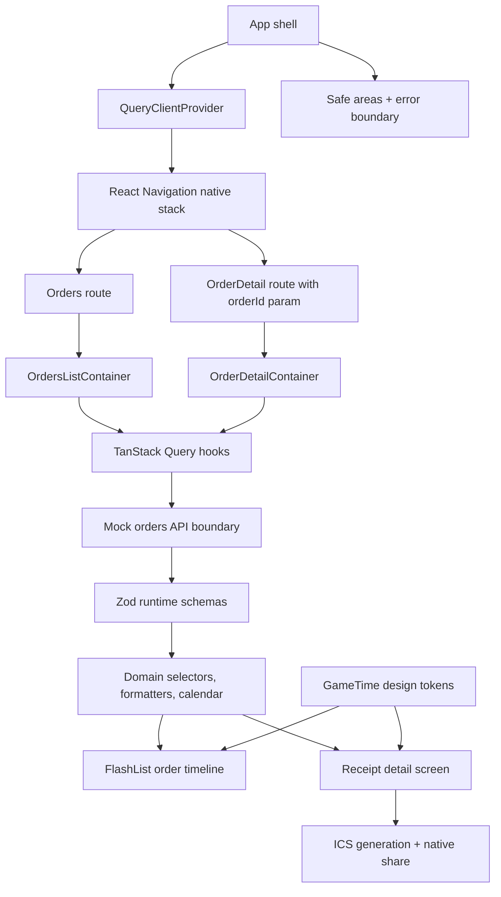
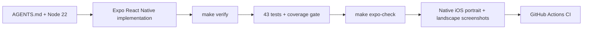

# GameTime Order History Mobile

[](https://github.com/jnrahme/GameTimeTest/actions/workflows/ci.yml)


Find the receipt. Share the night. Keep the group moving.

An Expo React Native mobile app for viewing past GameTime-style ticket
purchases, opening a receipt detail screen, and generating a share-ready
calendar event for friends. The implementation is deliberately mobile-first,
brand-aligned, rotation-aware, typed, tested, and reviewable.

Reviewer-facing line: a compact take-home prompt treated like a production
feature branch.

## Demo Video

[](docs/showcase/gametime-order-history-showcase.mp4)

[Watch the 67-second implementation walkthrough](docs/showcase/gametime-order-history-showcase.mp4).
It uses the native app screenshots below with ElevenLabs narration to cover the
purchase timeline, receipt detail, Share with Friends flow, rotation-aware UI,
and quality gates.

## Screenshots

These are not decorative mocks. They are generated from the working app and kept
in the repo as review assets. Together they cover the main user paths from the
take-home prompt: order history, filters/search, detail receipt, calendar
sharing, and rotation-aware layout. These captures come from the native Expo app
running in the iPhone 16 iOS Simulator, not from the web preview.

| 1. Order history                                                                              | 2. Receipt + Share with Friends                                                                                       | 3. Native iOS share                                                                                                    |
| --------------------------------------------------------------------------------------------- | --------------------------------------------------------------------------------------------------------------------- | ---------------------------------------------------------------------------------------------------------------------- |
|  |  |  |

| Search empty state                                                                                              | Past purchases filter                                                                                   | Shared confirmation                                                                                        |
| --------------------------------------------------------------------------------------------------------------- | ------------------------------------------------------------------------------------------------------- | ---------------------------------------------------------------------------------------------------------- |
|  |  |  |

| Rotation-aware landscape layout                                                                            |
| ---------------------------------------------------------------------------------------------------------- |
|  |

## Assessment Evidence

The attached PDF asks for an order history experience with these points. This
repo proves each one directly in the product surface, source, and tests.

| PDF requirement                               | Where it is proven                                                                                                                                                                                                                                                                                                                                                                      |
| --------------------------------------------- | --------------------------------------------------------------------------------------------------------------------------------------------------------------------------------------------------------------------------------------------------------------------------------------------------------------------------------------------------------------------------------------- |
| Display a list of the user's past purchases   | The order timeline is shown in the order history screenshots above. Implementation: [OrdersListScreen.tsx](src/features/orders/OrdersListScreen.tsx), [OrderCard.tsx](src/features/orders/OrderCard.tsx), and [mockOrders.ts](src/data/mockOrders.ts).                                                                                                                                  |
| Tapping a purchase opens a detail screen      | The receipt detail screenshot shows the selected order path. Implementation: [OrdersExperience.tsx](src/features/orders/OrdersExperience.tsx) handles selection and back navigation; [OrderDetailScreen.tsx](src/features/orders/OrderDetailScreen.tsx) renders the detail view.                                                                                                        |
| Detail includes event name and information    | The detail screen shows the event name, venue, date, category, confirmation, payment, and seats. Formatting is centralized in [formatters.ts](src/domain/orders/formatters.ts).                                                                                                                                                                                                         |
| Detail includes receipt with price breakdown  | The receipt screenshot shows subtotal, fees, tax, discount when present, and total. Implementation: [ReceiptRow.tsx](src/components/ReceiptRow.tsx) and `getReceiptLineItems` in [formatters.ts](src/domain/orders/formatters.ts).                                                                                                                                                      |
| Share with Friends generates a calendar event | The native receipt screenshot shows the CTA, the native iOS share sheet screenshot shows the generated event text, and the shared-state screenshot shows the completed action. Implementation: [calendar.ts](src/domain/orders/calendar.ts) builds the ICS payload and [shareCalendar.ts](src/services/shareCalendar.ts) sends it to native/web share surfaces with clipboard fallback. |
| Simulate network calls with mock data         | [ordersApi.ts](src/services/ordersApi.ts) simulates `GET /orders` and `GET /orders/:orderId` with latency, failure states, and Zod response validation from [schema.ts](src/domain/orders/schema.ts).                                                                                                                                                                                   |
| Include test coverage                         | Tests cover selectors, formatting, calendar generation, mock API validation, query hooks, route containers, list/detail UI, share fallback, and the app shell. Run `make verify` for TypeScript plus Jest coverage gates.                                                                                                                                                               |

## Implementation Showcase

Open the hosted implementation website at
[jnrahme.github.io/GameTimeTest](https://jnrahme.github.io/GameTimeTest/).
It explains the architecture, product tradeoffs, AI/MCP setup, AGENTS.md rules,
quality gates, rotation-aware design decisions, and GitHub repo polish in a
reviewer-friendly format.

## Run Locally

```bash
nvm install 22
nvm use
npm ci
npm run ios
```

Android is available with `npm run android`. A browser preview is available with
`npm run web`, but the implementation is mobile-first React Native.

## Build & Verify

Entry point: [Makefile](Makefile).

```bash
nvm use
make verify
make expo-check
```

`make verify` runs TypeScript in strict mode plus the Jest suite with coverage
thresholds: 95% statements, 95% lines, 90% functions, and 80% branches.
`make expo-check` verifies Expo SDK package compatibility.

## Architecture



- `src/domain/orders`: Zod runtime schemas, inferred TypeScript types,
  formatting, selectors, and calendar invite generation.
- `src/services`: validated mock network boundary for `GET /orders` and
  `GET /orders/:orderId`, plus native/web share integration.
- `src/features/orders/navigation.ts`: typed routes plus deep-link readiness for
  `gametime://orders` and `gametime://orders/:orderId`.
- `src/features/orders/queries.ts`: TanStack Query server-state hooks for
  caching, retry, loading, error, and refetch behavior.
- `src/features/orders/*Container.tsx`: route-aware containers that compose
  query state, local search/filter state, domain selectors, and screen props.
- `src/features/orders/*Screen.tsx`: mobile-first React Native presentation with
  FlashList virtualization, pull-to-refresh, native share flow, and rotation
  support.
- `src/components` and `src/theme`: reusable UI primitives, app error boundary,
  and semantic GameTime design tokens.

The UI follows the current `gametime.co` black, white, and mint visual language
while presenting a more receipt-focused mobile workflow. It is designed for
native phone ergonomics first: safe areas, rotation-aware portrait/landscape
layouts, 44px+ touch targets, accessible press labels, native share integration,
and responsive layouts that also hold up in Expo's web preview.

## Verification Loop



## Architecture Decisions

| Decision                                    | Why it exists                                                                                                                                                   | Where to inspect                                                                                                                                 |
| ------------------------------------------- | --------------------------------------------------------------------------------------------------------------------------------------------------------------- | ------------------------------------------------------------------------------------------------------------------------------------------------ |
| Expo SDK 56 on Node 22                      | Matches the current React Native stack while keeping setup repeatable with `nvm use`.                                                                           | [.nvmrc](.nvmrc), [package.json](package.json), [app.json](app.json)                                                                             |
| React Navigation native stack               | The prompt has two real screens. A navigator gives route params, Android hardware back, iOS swipe-back, and deep-link readiness without custom back-stack code. | [OrdersExperience.tsx](src/features/orders/OrdersExperience.tsx), [navigation.ts](src/features/orders/navigation.ts)                             |
| TanStack Query for server state             | Orders are fetched data with cache, retry, refetch, stale-time, loading, and error semantics. Query owns that; containers keep only local UI state.             | [App.tsx](App.tsx), [queries.ts](src/features/orders/queries.ts)                                                                                 |
| Containers separate behavior from rendering | Containers read routes and queries, derive filtered data, and pass plain props to screens. Screens stay testable and presentation-focused.                      | [OrdersListContainer.tsx](src/features/orders/OrdersListContainer.tsx), [OrderDetailContainer.tsx](src/features/orders/OrderDetailContainer.tsx) |
| Zod at the mock API boundary                | Mock data is treated like real backend data: it is validated before reaching the UI, and TypeScript types are inferred from the schemas.                        | [schema.ts](src/domain/orders/schema.ts), [ordersApi.ts](src/services/ordersApi.ts)                                                              |
| FlashList for the timeline                  | Order history is a list surface that can grow. Virtualization is included now so the implementation scales beyond seed data.                                    | [OrdersListScreen.tsx](src/features/orders/OrdersListScreen.tsx)                                                                                 |
| Native share with web fallback              | The primary experience is mobile. Web preview still behaves reasonably through `navigator.share` or clipboard fallback.                                         | [calendar.ts](src/domain/orders/calendar.ts), [shareCalendar.ts](src/services/shareCalendar.ts)                                                  |

## AI-Assisted Delivery Model

Codex was used as an engineering assistant with explicit guardrails, not as a
black-box generator:

- `AGENTS.md` sets the project rules: Node 22, Expo SDK 56 docs before RN/Expo
  changes, typed mock API boundaries, accessible mobile UI, and tests around
  order and sharing behavior.
- SmartAssist MCP was queried before architecture, edit, and git decisions per
  the workspace protocol. The local SmartAssist data directory was missing, so
  no memory lessons could be loaded or persisted; decisions fell back to the
  repository, prompt, docs, and verification evidence.
- Specialized Codex skills shaped the work: brainstorming for scope, React
  Native best practices for mobile architecture, UI/UX guidance for the hosted
  showcase, Playwright/browser checks for visual inspection, GitHub workflow
  guidance for publishing, and verification-before-completion for evidence
  before claims.
- The final public artifacts are designed to be reviewable: screenshots from the
  native iOS simulator, a hosted implementation page, CI, coverage gates, and
  explicit architecture decision records.

## Professional Repo Surface

The repo is structured so the public GitHub page communicates quality before a
reviewer even opens the source:

- Truthful badges for CI, Node 22, Expo SDK 56, React Native, TypeScript, and MIT.
- Community health files: [Code of Conduct](CODE_OF_CONDUCT.md),
  [Contributing](CONTRIBUTING.md), [Security](SECURITY.md), [License](LICENSE),
  and [.github/CODEOWNERS](.github/CODEOWNERS).
- Repeatable local and CI verification through `make verify`,
  `make expo-check`, and [.github/workflows/ci.yml](.github/workflows/ci.yml).
- Public repo metadata guidance in [docs/REPO_PROFILE.md](docs/REPO_PROFILE.md).
- Screenshot-backed documentation and a hosted implementation showcase.

## Tradeoffs

- React Navigation is intentionally included even for two screens because the
  detail view is route-addressable, deep-link-ready, and gets native back
  behavior without custom state machinery.
- TanStack Query is used for server state because it replaces hand-rolled
  loading/error/refetch/cache behavior while keeping local search/filter state
  simple and explicit in the list container.
- Calendar sharing generates standards-friendly ICS content and uses native/web
  share APIs when available, with clipboard fallback on web.
- Network calls are simulated with a mock API so the data boundary is easy to
  replace with a real backend.
- Tests cover high-risk domain behavior, API validation, query hooks, route
  containers, sharing fallbacks, list/detail interactions, app shell behavior,
  and error recovery.
