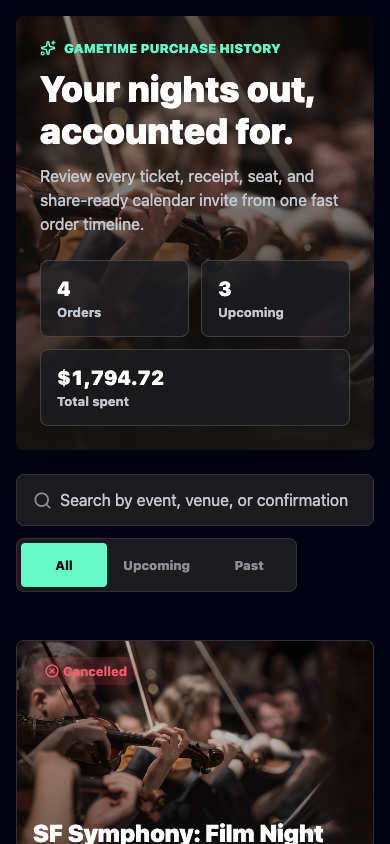
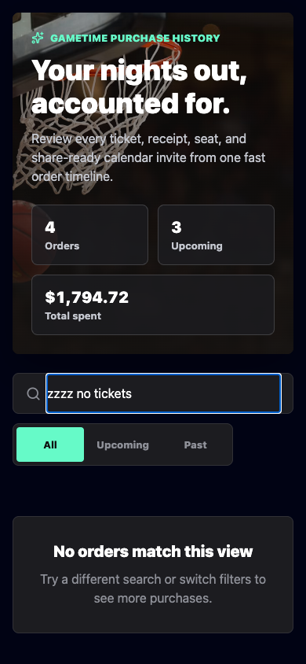
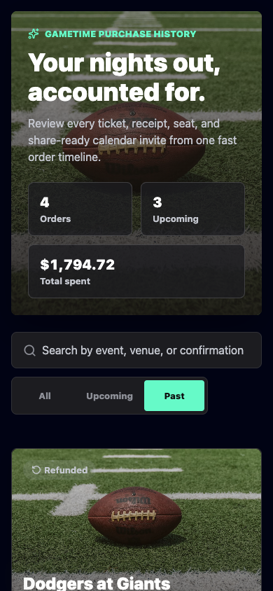
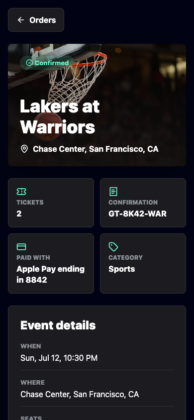
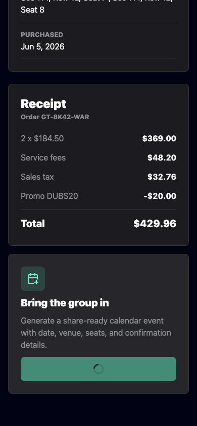
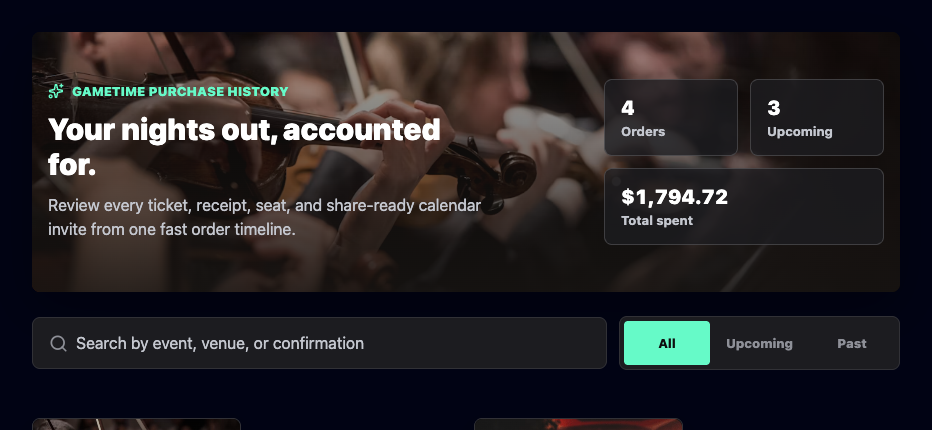
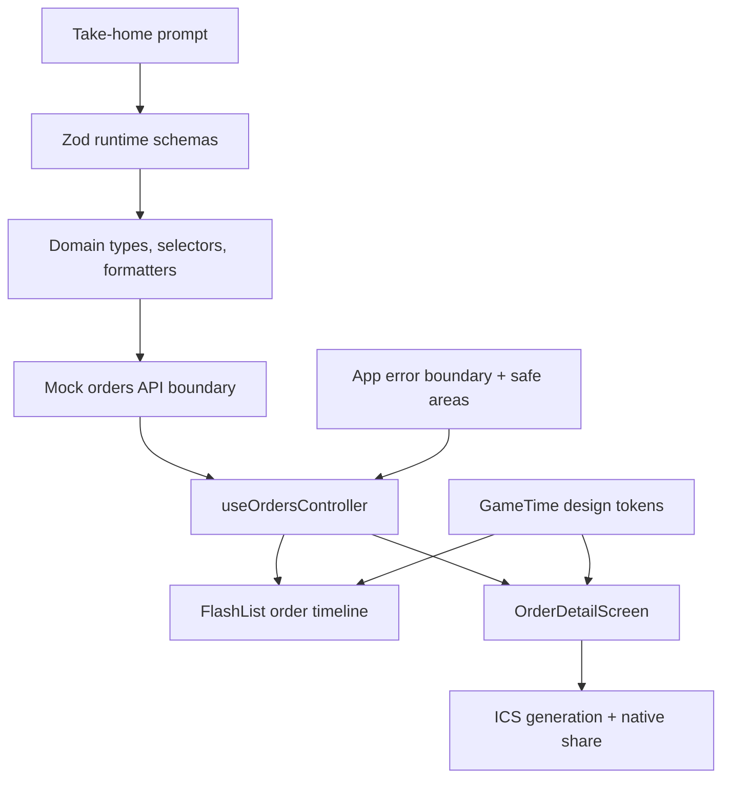
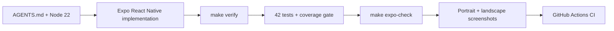

# GameTime Order History Mobile

[](https://github.com/jnrahme/GameTimeTest/actions/workflows/ci.yml)


Find the receipt. Share the night. Keep the group moving.

An Expo React Native mobile app for viewing past GameTime-style ticket
purchases, opening a receipt detail screen, and generating a share-ready
calendar event for friends. The implementation is deliberately mobile-first,
brand-aligned, rotation-aware, typed, tested, and reviewable.

Reviewer-facing line: a compact take-home prompt treated like a production
feature branch.

## Screenshots

These are not decorative mocks. They are generated from the working app and kept
in the repo as review assets. Together they cover the main user paths from the
take-home prompt: order history, filters/search, detail receipt, calendar
sharing, and rotation-aware layout.

| Order history | No-results search |
| --- | --- |
|  |  |

| Past purchases filter | Receipt detail and share entry |
| --- | --- |
|  |  |

| Calendar share confirmation | Landscape layout |
| --- | --- |
|  |  |

## Assessment Evidence

The attached PDF asks for an order history experience with these points. This
repo proves each one directly in the product surface, source, and tests.

| PDF requirement | Where it is proven |
| --- | --- |
| Display a list of the user's past purchases | The order timeline is shown in the order history screenshots above. Implementation: [OrdersListScreen.tsx](src/features/orders/OrdersListScreen.tsx), [OrderCard.tsx](src/features/orders/OrderCard.tsx), and [mockOrders.ts](src/data/mockOrders.ts). |
| Tapping a purchase opens a detail screen | The receipt detail screenshot shows the selected order path. Implementation: [OrdersExperience.tsx](src/features/orders/OrdersExperience.tsx) handles selection and back navigation; [OrderDetailScreen.tsx](src/features/orders/OrderDetailScreen.tsx) renders the detail view. |
| Detail includes event name and information | The detail screen shows the event name, venue, date, category, confirmation, payment, and seats. Formatting is centralized in [formatters.ts](src/domain/orders/formatters.ts). |
| Detail includes receipt with price breakdown | The receipt screenshot shows subtotal, fees, tax, discount when present, and total. Implementation: [ReceiptRow.tsx](src/components/ReceiptRow.tsx) and `getReceiptLineItems` in [formatters.ts](src/domain/orders/formatters.ts). |
| Share with Friends generates a calendar event | The share confirmation screenshot shows the calendar flow after tapping the CTA. Implementation: [calendar.ts](src/domain/orders/calendar.ts) builds the ICS payload and [shareCalendar.ts](src/services/shareCalendar.ts) sends it to native/web share surfaces with clipboard fallback. |
| Simulate network calls with mock data | [ordersApi.ts](src/services/ordersApi.ts) simulates `GET /orders` and `GET /orders/:orderId` with latency, failure states, and Zod response validation from [schema.ts](src/domain/orders/schema.ts). |
| Include test coverage | Tests cover selectors, formatting, calendar generation, mock API validation, controller states, list/detail UI, share fallback, and the app shell. Run `make verify` for TypeScript plus Jest coverage gates. |

## Implementation Showcase

Open the hosted implementation website at
[jnrahme.github.io/GameTimeTest](https://jnrahme.github.io/GameTimeTest/).
It explains the architecture, product tradeoffs, MCP/skills setup, AGENTS.md
rules, quality gates, rotation-aware design decisions, and GitHub repo polish.

## Run Locally

```bash
nvm install 22
nvm use
npm ci
npm run ios
```

Android is available with `npm run android`. A browser preview is available with
`npm run web`, but the implementation is mobile-first React Native.

## Build & Verify

Entry point: [Makefile](Makefile).

```bash
nvm use
make verify
make expo-check
```

`make verify` runs TypeScript in strict mode plus the Jest suite with coverage
thresholds: 95% statements, 95% lines, 90% functions, and 80% branches.
`make expo-check` verifies Expo SDK package compatibility.

## Architecture



- `src/domain/orders`: Zod runtime schemas, inferred TypeScript types,
  formatting, selectors, and calendar invite generation.
- `src/services`: validated mock network boundary for `GET /orders` and
  `GET /orders/:orderId`, plus native/web share integration.
- `src/features/orders`: screen-level state orchestration and mobile-first React
  Native presentation with FlashList virtualization and pull-to-refresh.
- `src/components` and `src/theme`: reusable UI primitives, app error boundary,
  and semantic GameTime design tokens.

The UI follows the current `gametime.co` black, white, and mint visual language
while presenting a more receipt-focused mobile workflow. It is designed for
native phone ergonomics first: safe areas, rotation-aware portrait/landscape
layouts, 44px+ touch targets, accessible press labels, native share integration,
and responsive layouts that also hold up in Expo's web preview.

## Verification Loop



## Professional Repo Surface

The repo is structured so the public GitHub page communicates quality before a
reviewer even opens the source:

- Truthful badges for CI, Node 22, Expo SDK 56, React Native, TypeScript, and MIT.
- Community health files: [Code of Conduct](CODE_OF_CONDUCT.md),
  [Contributing](CONTRIBUTING.md), [Security](SECURITY.md), [License](LICENSE),
  and [.github/CODEOWNERS](.github/CODEOWNERS).
- Repeatable local and CI verification through `make verify`,
  `make expo-check`, and [.github/workflows/ci.yml](.github/workflows/ci.yml).
- Public repo metadata guidance in [docs/REPO_PROFILE.md](docs/REPO_PROFILE.md).
- Screenshot-backed documentation and a hosted implementation showcase.

## Tradeoffs

- Navigation is local state instead of a routing library because the prompt needs
  two screens, not deep linking; Android hardware back is still handled for the
  detail view.
- Calendar sharing generates standards-friendly ICS content and uses native/web
  share APIs when available, with clipboard fallback on web.
- Network calls are simulated with a mock API so the data boundary is easy to
  replace with a real backend.
- Tests cover high-risk domain behavior, API validation, controller state,
  sharing fallbacks, list/detail interactions, app shell behavior, and error
  recovery.
